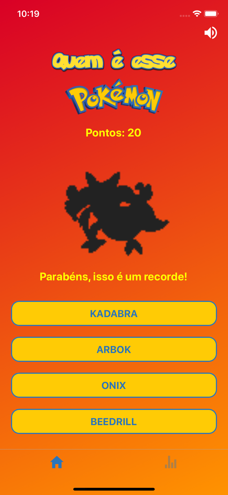
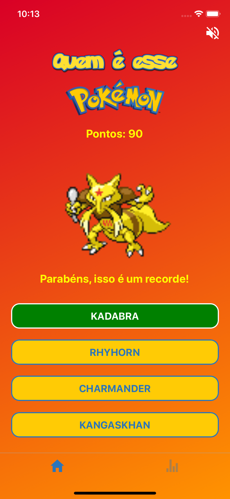
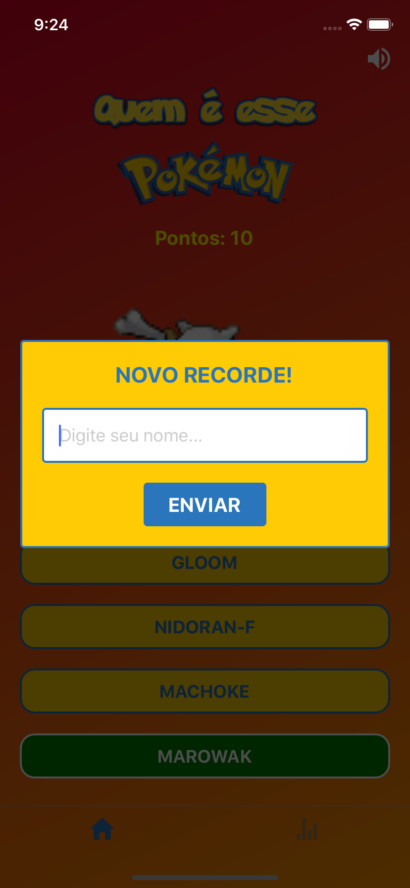
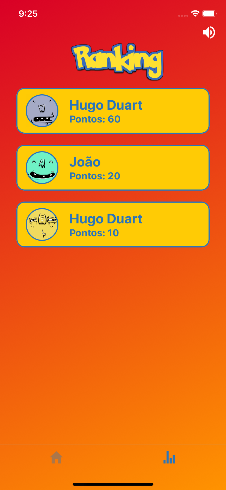

# Who is this Pokémon?


<p align="center">
  
</p>
<p align="center">
  
</p>

- [Who is this Pokémon?](#who-is-this-pok%c3%a9mon)
  - [:interrobang: Descrição :interrobang:](#interrobang-descri%c3%a7%c3%a3o-interrobang)
  - [:computer: Tecnologias :computer:](#computer-tecnologias-computer)
  - [:warning: Regras :warning:](#warning-regras-warning)
  - [:bar_chart: Ranking :bar_chart:](#barchart-ranking-barchart)
  - [:iphone: Como executar :iphone:](#iphone-como-executar-iphone)
  - [:construction: TODO :construction:](#construction-todo-construction)

## :interrobang: Descrição :interrobang:

**Quem é esse pokémon ?** é um jogo bem simples e divertido, feito em [React Native](https://facebook.github.io/react-native/), onde é apresentado ao jogador a sombra de um pokémon aleatório, o jogador recebe quatro opções de nome e deve adivinhar qual pokémon está por trás da sombra.

<p align="center">
  
  
</p>

## :computer: Tecnologias :computer:

- [React Native](https://facebook.github.io/react-native/)
- [Redux](https://redux.js.org/)
- [Styled Components](https://styled-components.com/)
- [React Navigation](https://reactnavigation.org/)
- [Async Storage](https://github.com/react-native-community/async-storage)
- [Audio Toolkit](https://github.com/react-native-community/react-native-audio-toolkit)
- [Vector Icons](https://github.com/oblador/react-native-vector-icons)

## :warning: Regras :warning:

- A cada acerto o jogador recebe **10 pontos**, os pontos são acumulativos e são utilizados para criar o _ranking_.
- Nenhum erro é tolerado, então caso o jogador escolha a opção errada, a pontuação é **zerada**.
- Se o jogador fizer pontos suficientes, será aberto uma caixa para que o mesmo digite o seu nome, assim ele será registrado no _ranking_ do aplicativo.

## :bar_chart: Ranking :bar_chart:

<p align="center">
  
  
</p>

O _Ranking_ pode ser acessado clicando na barra de navegação localizada na parte inferior do aplicativo. O _ranking_ mostra as **dez** melhores pontuações. Os dados do _ranking_ ficam salvos internamente na memória do dispositivo.

## :iphone: Como executar :iphone:

Para executar o projeto é necessário que você tenha o ambiente React Native configurado, você pode seguir esse [GUIA](https://docs.rocketseat.dev/ambiente-react-native/introducao) para tal.

Depois de configurar o ambiente, basta fazer o clone no projeto:

```sh
git clone https://github.com/fhugoduarte/rn-WhoIsThisPokemon.git
```

Entre na pasta do projeto e execute o comando para instalar as dependências do projeto

```sh
yarn
```
ou
```sh
npm install
```
Em seguida execute o comando referente a plataforma ao qual deseja executar

Android:

```sh
react-native run-android
```

iOS:

```sh
react-native run-ios
```

## :construction: TODO :construction:

- [x] Adicionar música tema.
- [x] Criar esquema de _ranking_.
- [ ] Adicionar níveis de dificuldade.
